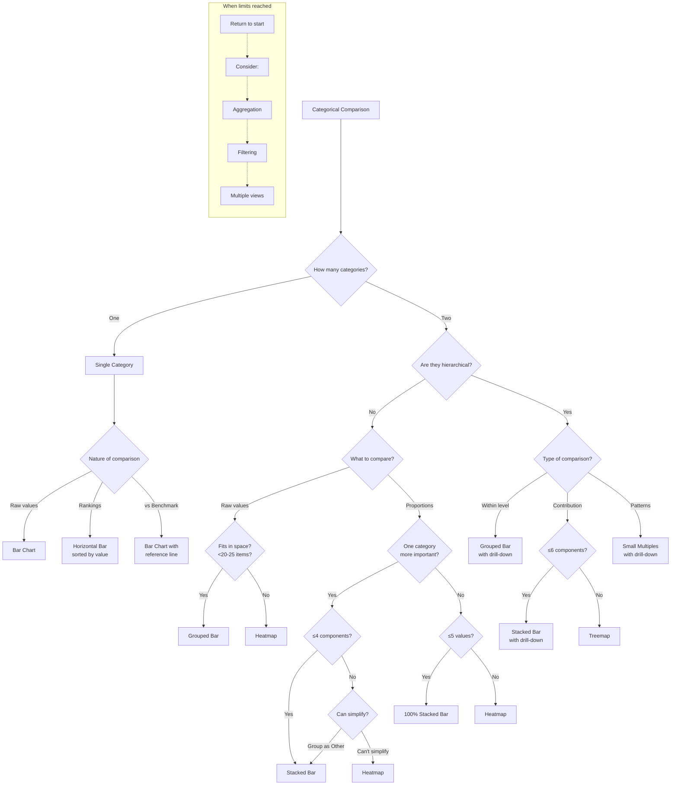
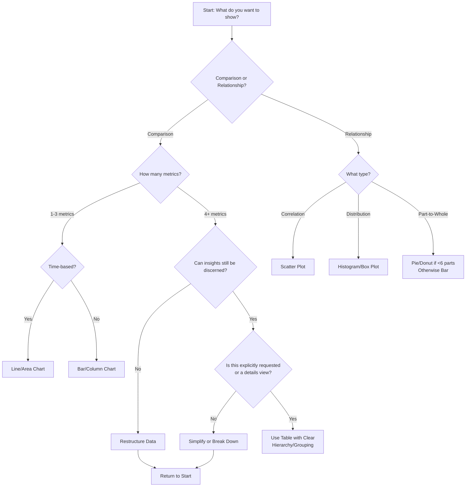

# Selecting visualization content and type

## Comparisons
### Categorical

> **Bar, column, and line charts are the easiest to understand.** We will try to use these where possible. Alternative chart types may be used when report pages are too bar chart heavy.

## **By data relationship**

Frequent stories (data relationships) used for Insights reports include ranking, magnitude, part to whole, and change over time.

| Relationship | Purpose | Chart to Use | Dealing with Multiples | Color Note |
| --- | --- | --- | --- | --- |
| Ranking | Show an item's position in an ordered list | Standard horizontal bar | Grouped | A diverging palette works well |
| Magnitude | Show size comparisons | Standard bar - horizontal for longer dimension labels | Grouped | A sequential palette works well |
| Part to Whole | Show how a single entity can be broken down into its component elements | Pie chart (if less than 5), bar chart | Treemap (if not too many categories), stacked bar (if not too many subcategories), area chart (over time) | A categorical palette works well |
| Change over Time | Give emphasis to changing trends | Line chart | Shouldn't exceed three intersecting lines -- break out the chart | Single color, multicolored if more than one measure or dimension |

## **Details**

| Chart Type | When to Use | Notes |
| --- | --- | --- |

| Chart Type | When to Use | Notes |
| --- | --- | --- |
| Table | When you need to compare or look up individual values; require precise values; values involve multiple units of measure; and data has to communicate quantitative information but not trends. | Consider using sparklines to communicate changes in trend. |
| Vertical Bar (Column) | To compare different values when specific values are important and users will look up and compare individual values between each column. | Use for small number of categories (up to five, but not more than seven). Only show trends if there are a reasonably low number of data points (less than 20) and if every data point has a clearly visible value. |
| Stacked Column | To show a composition. | Don't use too many composition items (not more than three or four). |
| Bar | When category names are long or number of categories is greater than seven. |  |
| Stacked Bar | To show changes in composition. | Discouraged, unless there are only a few composition parts and the emphasis is on composition, not comparison. |
| Line | When you have a continuous data set and want to show trends based on data over a period of time. | Suited for high number of data points (more than 20). Emphasis is on continuation or flow of values (trend), but still some support for single value comparisons using data markers (with less than 20 data points). |
| Area | To present accumulative value changes over time. | Don't use for highly fluctuating values. |
| Stacked Area | To show changes in composition over time. | Don't use for exact comparison or if stacking more than three to five categories. |
| Donut (used instead of pie) | To visualize a part-to-whole relationship or a composition. | Use only for less than six categories or if there's a clear winner to focus on. Total sum of all segments should equal 100 percent. Not for individual comparisons or exact values. |
| Scatter | For correlation and distribution analysis. | Use to show relationships between two or three numerical variables, patterns in large data sets, correlations, clusters, or outliers. Not for exact comparisons. |
| Gauge | To show progress toward a goal, represent a percentile measure, show an exact value and meaning of a single measure, or display a single bit of information. |  |
| Combo | To display a line chart and a column chart with the same X-axis, compare multiple measures with different value ranges, or illustrate the relationship between measures. | Not for exact comparisons. |
| Treemap | To visualize hierarchical data structure and show the proportion of each branch in the hierarchy. | Suitable for showing the hierarchical structure of data and the relationship between data points at different levels. |
| KPI | To display key performance indicators (metrics that measure success) and show how they are performing relative to a target or benchmark. | Use to quickly communicate the current status of an important metric or to track progress toward a goal. |

