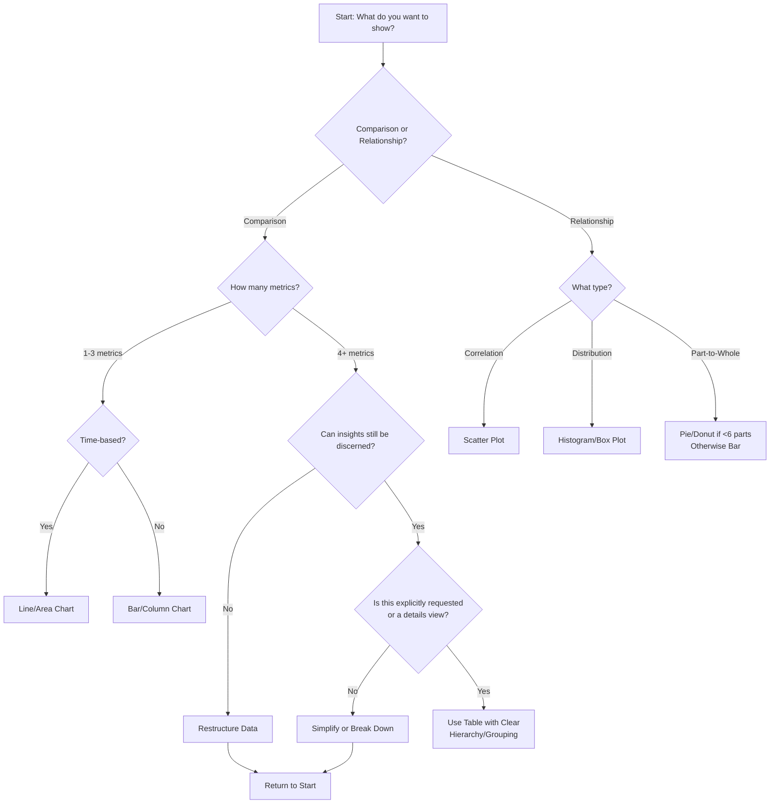

# Selecting visualization content and type
> Effective data storytelling with charts

```mermaid
graph TD
    A[Start: What do you want to show?] --> B{Comparison or Relationship?}
    B -->|Comparison| C{How many metrics?}
    B -->|Relationship| D{What type?}
    
    C -->|1-3 metrics| E{Time-based?}
    C -->|4+ metrics| F{Can insights still be discerned?}
    
    F -->|No| G[Restructure Data]
    F -->|Yes| H{Is this explicitly requested<br/>or a details view?}
    
    H -->|No| I[Simplify or Break Down]
    H -->|Yes| J[Use Table with Clear<br/>Hierarchy/Grouping]
    
    E -->|Yes| K[Line/Area Chart]
    E -->|No| L[Bar/Column Chart]
    
    D -->|Correlation| M[Scatter Plot]
    D -->|Distribution| N[Histogram/Box Plot]
    D -->|Part-to-Whole| O[Pie/Donut if <6 parts<br/>Otherwise Bar]
    
    G --> P[Return to Start]
    I --> P
```
